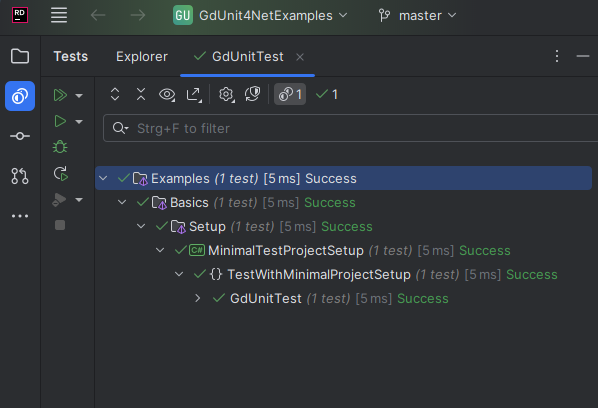

# Test With Minimal Project Setup

A minimal example demonstrating the simplest possible gdUnit4Net test setup in a Godot project.

## What This Example Shows

This project demonstrates:

- **Minimal project structure** for gdUnit4Net testing
- **Basic .csproj configuration** with essential properties and packages
- **Simple test class** with a basic assertion
- **Godot.NET.Sdk integration** for testing Godot projects

## Files Overview

- **`project.godot`** - Basic Godot project configuration
- **`MinimalTestProjectSetup.csproj`** - Minimal test project setup with detailed comments
- **`GdUnitTest.cs`** - Your first gdUnit4Net test demonstrating basic assertions

## Key Learning Points

1. **Project Setup**: How to configure a Godot project for gdUnit4Net testing
2. **Essential Packages**: The three core packages needed for gdUnit4Net
3. **Basic Test Structure**: Using `[TestSuite]` and `[TestCase]` attributes
4. **Simple Assertions**: Using `AssertThat()` for basic string comparison

## Running the Tests

1. Open the project in your IDE (Rider, Visual Studio, or VS Code)
2. Build the project: `dotnet build`
3. Run tests through your IDE's test explorer or use: `dotnet test`

## Next Steps

After understanding this minimal setup:

- Explore more assertion types in the [Basics/Tests](../../Tests/) folder
- See real-world examples in the [Demos](../../../Demos/) folder
- Check the [Advanced](../../Advanced/) examples for complex scenarios
