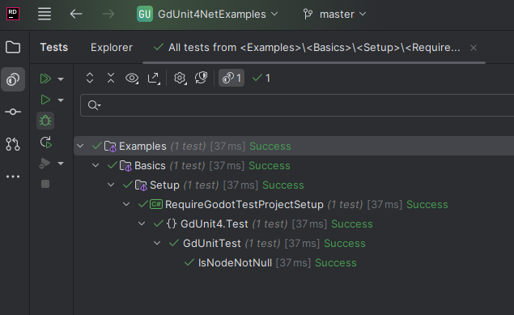

# Require Godot Test Project Setup

An example demonstrating how to test Godot-specific classes and functionality that require the Godot runtime.



## What This Example Shows

This project demonstrates:

- **Setting up test environment** for Godot runtime testing (GODOT_BIN)
- **Testing Godot-derived classes** that inherit from GodotObject, Node, etc.
- **Using [RequireGodotRuntime]** attribute for tests that need Godot's runtime
- **Proper memory management** with Godot objects (calling Free())
- **Godot.NET.Sdk integration** for accessing Godot types and functionality

## Prerequisites

### Godot Runtime Configuration

Tests that use `[RequireGodotRuntime]` need the Godot executable to be available. Set the `GODOT_BIN` environment variable:

**Windows:**

```cmd
set GODOT_BIN=C:\path\to\Godot_v4.4.1-stable_mono_win64.exe
```

**Linux/macOS:**

```bash
export GODOT_BIN=/path/to/Godot_v4.4.1-stable_mono_linux64
```

**Without this environment variable, you'll see:**

```cmd
Godot runtime is not configured. The environment variable 'GODOT_BIN' is not set or empty. 
Please set it to the Godot executable path.
No test is available in [...].dll
```

## Files Overview

- **`project.godot`** - Godot project configuration enabling .NET support
- **`RequireGodotTestProjectSetup.csproj`** - Test project configured for Godot runtime testing
- **`GdUnitTest.cs`** - Test class showing how to test Godot objects

## Key Learning Points

1. **Environment Setup**: How to configure GODOT_BIN environment variable for Godot runtime access
2. **[RequireGodotRuntime] Attribute**: Required for tests that use Godot types
3. **Memory Management**: Always call Free() on Godot objects to prevent leaks
4. **Runtime Dependency**: These tests need the Godot engine runtime to execute

## Difference from MinimalTestProjectSetup

| Aspect | MinimalTestProjectSetup | RequireGodotTestProjectSetup |
|--------|------------------------|------------------------------|
| **Purpose** | Test pure .NET code | Test Godot-specific functionality |
| **Runtime** | .NET only | Requires Godot runtime |
| **Test Attribute** | `[TestCase]` only | `[TestCase]` + `[RequireGodotRuntime]` |
| **Object Types** | Standard .NET objects | Godot objects (Node, GodotObject, etc.) |
| **Memory Management** | Automatic GC | Manual Free() calls needed |

## Running the Tests

1. **Ensure Prerequisites**: Verify `GODOT_BIN` environment variable is set (see Prerequisites above)
2. **Open the project** in your IDE (Rider, Visual Studio, or VS Code)
3. **Build the project**: `dotnet build`
4. **Run tests** through your IDE's test explorer or use: `dotnet test`

**Note**: These tests require the Godot runtime to be available and the `GODOT_BIN` environment variable to be set.

## Test Execution Performance

**⚠️ Important**: Test execution will take longer than regular .NET tests due to Godot runtime overhead:

- **First Run**: Expect 30+ seconds as gdUnit4Net will:
  - Install the test runner to `RequireGodotTestProjectSetup/gdunit4_testadapter_v5/` (from gdUnit4.api package)
  - Recompile the project with the test adapter

- **Subsequent Runs**: Still slower than pure .NET tests (~10-15 seconds) because:
  - Godot editor needs to start and initialize
  - Test runner must load the Godot runtime environment
  - Each test requiring `[RequireGodotRuntime]` runs in the Godot context

This is normal behavior - the trade-off for being able to test Godot-specific functionality.

---

## Common Issues

**"No test is available" Error?**
This usually means the `GODOT_BIN` environment variable is not set. See Prerequisites section above.

**Tests Fail with Runtime Errors?**
Ensure you're running tests in an environment where Godot runtime is available and the `GODOT_BIN` environment variable is correctly set to a valid Godot executable.

**Memory Leaks?**
Always call `Free()` on Godot objects after testing to prevent memory leaks.

## Next Steps

After understanding Godot runtime testing:

- Explore testing Nodes and Scenes in [Advanced examples](../../Advanced/)
- See real-world Godot testing in the [Demos](../../../Demos/) folder
- Learn about testing signals and Godot-specific functionality
