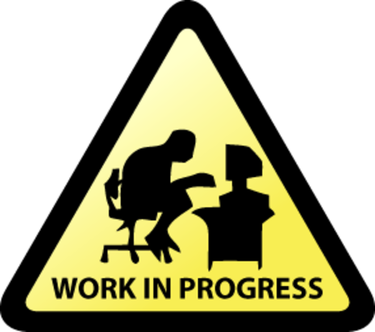

<h1 align="center">GdUnit4Net Examples</h1>
<p align="center">
  </br>
</p>

This repository contains example projects and test cases demonstrating how to use [gdUnit4Net](https://github.com/MikeSchulze/gdUnit4Net), a C# unit testing framework for Godot 4.

## Table of Contents

- [Examples & Quick Start](/Examples/README.md)
- [Requirements & Prerequisites](#requirements--prerequisites)
- [Installation](#installation)
- [Code Quality and Best Practices](#code-quality-and-best-practices)
    - [Build Configuration](#build-configuration)
    - [Code Style Enforcement](#code-style-enforcement)
    - [Documentation Practices](#documentation-practices)
    - [IDE Integration](#ide-integration)
- [Contributing](#contributing)
- [License](#license)

## Project Structure

- **Examples/** - Complete examples and tutorials
- **Demos/** - Full demo projects with comprehensive tests

## Requirements & Prerequisites

To work with this project, you'll need:

### Software Requirements

- **Godot Engine**: Version 4.4.x with .NET/Mono support enabled
- **.NET SDK**: Version 9.0.x
- **IDE**: One of the following:
    - Visual Studio 2022
    - Visual Studio Code with C# extension
    - JetBrains Rider (recommended for best testing experience)

### Project Specifications

- **Framework**: .NET 9.0
- **Language Version**: C# 12.0
- **Code Style**: Standard .NET naming conventions and formatting (enforced via .editorconfig)
- **Documentation**: XML documentation required for all public members

---

## Installation

### Setup Steps

1. **Clone the repository**
   ```bash
   git clone https://github.com/MikeSchulze/gdUnit4NetExamples.git
   cd gdUnit4NetExamples
   ```

2. **Verify your installed .NET SDKs**
   ```bash
   dotnet --list-sdks
    7.0.404 [C:\Program Files\dotnet\sdk]
    8.0.411 [C:\Program Files\dotnet\sdk]
   ```
   Ensure .NET 9.0.x is listed among the installed SDKs.

   **If .NET 9.0 is not installed:**

   a. Download the .NET 9.0 SDK from the [official .NET download page](https://dotnet.microsoft.com/download/dotnet)

   b. Follow the installation instructions for your operating system

   c. After installation, verify with:
   ```bash
   dotnet --list-sdks
    7.0.404 [C:\Program Files\dotnet\sdk]
    8.0.411 [C:\Program Files\dotnet\sdk]
    9.0.304 [C:\Program Files\dotnet\sdk]
   ```

3. **Build the project**
   ```bash
   dotnet build
   ```
   This will restore all required NuGet packages and build the project.

---

---

## Code Quality and Best Practices

This example project demonstrates not only how to use GdUnit4Net for testing but also showcases best practices for maintaining high-quality C# code in Godot projects.

### Build Configuration

#### Directory.Build.props

We use a `Directory.Build.props` file to centralize common build settings across all projects. This ensures consistent code quality enforcement without having to duplicate settings
in each project file.

Key features:

- Enables .NET code analyzers
- Enforces code style rules during build
- Treats warnings as errors to maintain strict quality standards
- Generates XML documentation from code comments
- Includes StyleCop and Microsoft analyzers for comprehensive rule checking

```xml
<PropertyGroup>
  <EnableNETAnalyzers>true</EnableNETAnalyzers>
  <AnalysisLevel>latest</AnalysisLevel>
  <AnalysisMode>All</AnalysisMode>
  <EnforceCodeStyleInBuild>true</EnforceCodeStyleInBuild>
  <TreatWarningsAsErrors>true</TreatWarningsAsErrors>
  <GenerateDocumentationFile>true</GenerateDocumentationFile>
</PropertyGroup>
```

### Code Style Enforcement

#### .editorconfig

The repository includes a comprehensive `.editorconfig` file that defines coding standards. This file is automatically recognized by Visual Studio, VS Code, Rider, and other
editors that support the EditorConfig standard.

Benefits:

- Consistent code formatting across all team members
- Automatic enforcement of naming conventions
- Standardized indentation, spacing, and line breaks
- Enforced documentation practices

### Documentation Practices

All code in this example project includes proper XML documentation:

- Classes are documented with `<summary>` tags explaining their purpose
- Methods include parameter descriptions and return value documentation
- Examples demonstrate good practices for documenting test intentions

Example:

```csharp
/// <summary>
/// Demonstrates comparing two Godot.Vector2 instances.
///
/// This test verifies that Godot's Vector2 equality comparison works correctly.
/// Note that this is testing Godot's Vector2 type, not the System.Numerics.Vector2 type.
/// </summary>
[TestCase]
public void CompareGodotVector2()
    => AssertThat(new Vector2(1, 1)).IsEqual(new Vector2(1, 1));
```

### IDE Integration

This project is configured to work seamlessly with major IDEs:

#### Visual Studio

- Format on save is enabled through EditorConfig
- Code analysis runs in real-time
- XML documentation is validated during build

#### Visual Studio Code

- Settings in .vscode/settings.json configure the C# extension
- OmniSharp is configured to respect EditorConfig rules
- Format on save and analysis are enabled

#### JetBrains Rider

- EditorConfig support is enabled
- Code inspection profiles match the project standards
- Automatic formatting on save is configured

### Benefits for Your Projects

By following these patterns, you can:

1. Ensure consistent code quality across your team
2. Catch issues early through static analysis
3. Maintain readable and well-documented code
4. Reduce the effort needed for code reviews
5. Make your codebase more maintainable in the long term

## Contributing

Contributions are welcome! Please feel free to submit a Pull Request.

## License

This project is licensed under the MIT License - [see the LICENSE file](LICENSE) for details.
